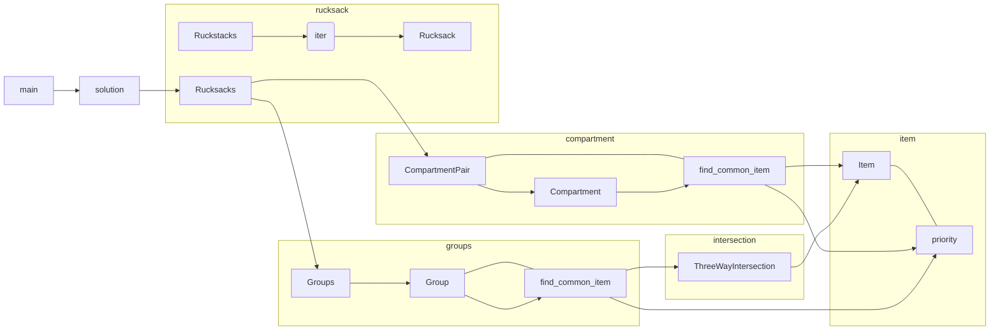

# AOC 2022 Day 3 Answer

程式碼有完整註釋和測試，這裡只說明一些比較有趣的地方。

## 題目

<https://adventofcode.com/2022/day/3>

## 執行

改 `inputs.txt` 之後 `cargo run --release`。

## Benchmark

## 關係圖

## Practices

- 根據題目名詞切出 structures 及其功能
- 盡量抽象
- 選擇正確的資料結構並善用演算法
- 用 `hyperfine` 和 `cargo flamegraph` 找出效能問題
- 盡量用 `delegate` 而非 `Deref`

希望這個 codebase 可以對你有所啟發 :)

## Special parts

### `hashset`

- 實作 `from_array()` 方便 pre-allocation

Link: [src/hashset.rs](src/hashset.rs)

### `item`

- `priority`: 純 bit 運算，沒有 conditions :-)

Link: [src/item.rs](src/item.rs)

### `intersection`

- `ThreeWayIntersection`: `HashSet::Intersection` 只能 intersect 2 個 set，所以寫了一個封裝結構辦到 intersect 3 個 set。

## License

AGPL-3.0-only
