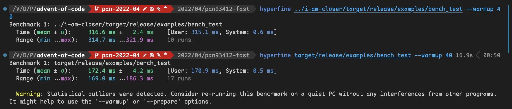

# **Optimized version of i-am-closer's solution** with pan's architecture

The performance-oriented and well-engineered solution.

Thanks to [`i-am-closer`'s solution](https://github.com/rust-tw/advent-of-code/tree/main/2022/04/i-am-closer) a lot! His solution improved the performance of my architecture extremely – $17349ns$ → $0ns$!

I also added some inline and graph explanation to his solution :) Besides, our optimization hacks improve the algorithm's speed by $45.54\\\%$:



## Run

```bash
cargo run --release your_filename.txt
```

## Bench Result

```plain
test tests::bench_big_input_bufread       ... bench:      85,823 ns/iter (+/- 2,357)
test tests::bench_big_input_overlap       ... bench:           0 ns/iter (+/- 0)
test tests::bench_big_input_read_string   ... bench:      63,241 ns/iter (+/- 1,331)
test tests::bench_big_input_subset        ... bench:           0 ns/iter (+/- 0)
test tests::bench_small_input_bufread     ... bench:         606 ns/iter (+/- 77)
test tests::bench_small_input_overlap     ... bench:           0 ns/iter (+/- 0)
test tests::bench_small_input_read_string ... bench:         388 ns/iter (+/- 24)
test tests::bench_small_input_subset      ... bench:           0 ns/iter (+/- 0)
```

## File Hierarchy

- `benches`
  - `test_aoc.rs`: Bench our functions
- `examples`
  - `bench_test.rs`: The example of this library (also for profiling).
- `src`
  - `main.rs`: CLI interface
  - `lib.rs`: AoC 2022 D4 library
  - `assignment.rs`: See <https://adventofcode.com/2022/day/4>
  - `section.rs`: See <https://adventofcode.com/2022/day/4>
- `tests`
  - `testdata`: A bunch of raw testdata.
  - `test_actual_case`: Integration Test.

## SCC

```plain
───────────────────────────────────────────────────────────────────────────────
Language                 Files     Lines   Blanks  Comments     Code Complexity
───────────────────────────────────────────────────────────────────────────────
JSON                       225       225        0         0      225          0
D                          196      1888      474         0     1414          0
Rust                        11       565       97        30      438         23
Plain Text                   4      1016        0         0     1016          0
TOML                         3        45       11         0       34          0
LLVM IR                      2        16        4         2       10          0
License                      1       661      117         0      544          0
Markdown                     1        71       14         0       57          0
───────────────────────────────────────────────────────────────────────────────
Total                      443      4487      717        32     3738         23
───────────────────────────────────────────────────────────────────────────────
Estimated Cost to Develop (organic) $107,861
Estimated Schedule Effort (organic) 5.90 months
Estimated People Required (organic) 1.62
───────────────────────────────────────────────────────────────────────────────
Processed 509145 bytes, 0.509 megabytes (SI)
───────────────────────────────────────────────────────────────────────────────
```

## License

`AGPL-3.0-only`
